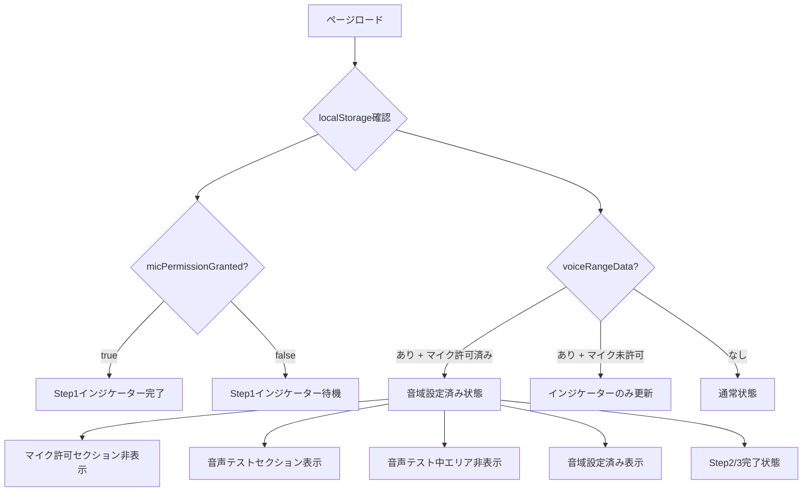
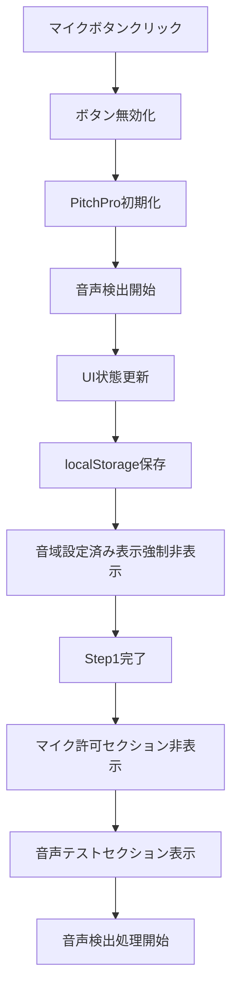
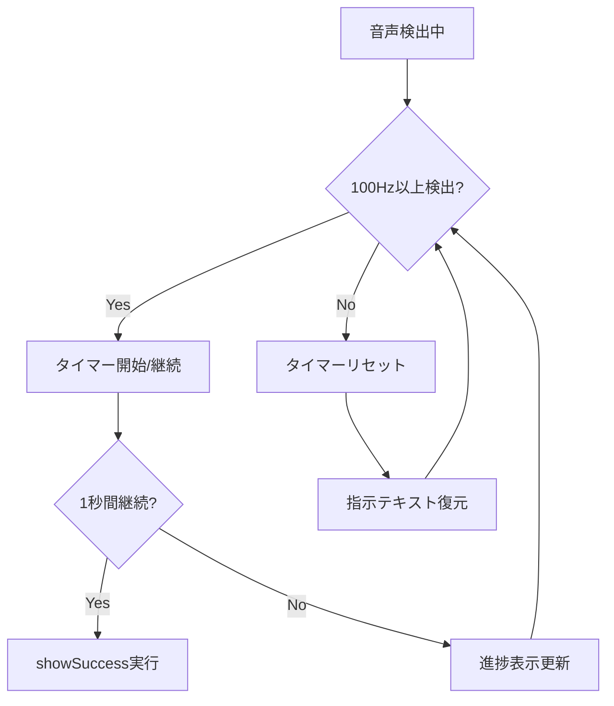
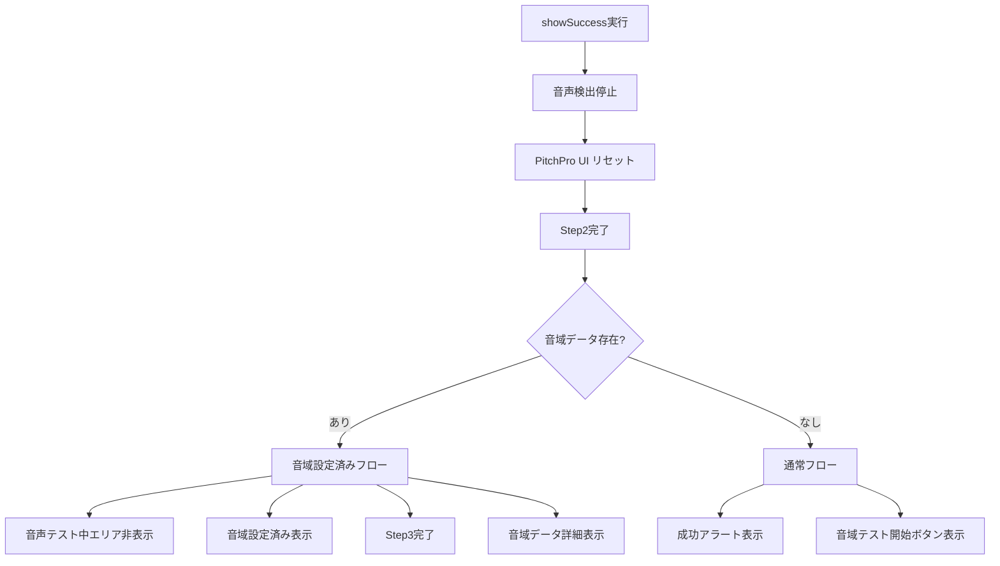

# Preparation Step1 完全フロー図

## 🎯 概要
preparation-step1.htmlの完全な処理フローとUI状態遷移を図式化したドキュメント

## 📋 初期状態
```
ページロード時:
├── マイクロフォンの許可セクション (表示)
├── 音声テストセクション (非表示)
└── 音域設定済み表示 (非表示)

ステータス表示:
├── Step1: マイク許可 (pending)
├── Step2: 音声テスト (pending)  
└── Step3: 音域テスト (pending)
```

## 🔄 メインフロー

### Phase 1: ページロード時の判定


### Phase 2: マイクボタンクリック処理


### Phase 3: 音声認識処理


### Phase 4: 音声認識成功時の分岐


## 🎮 ボタン機能

### 音域設定済み表示のボタン
```
音域を再測定ボタン:
├── localStorage: step1Completed = true
├── 遷移先: preparation-step2.html
└── 用途: 音域を測定し直す

トレーニング開始ボタン:
├── localStorage: step1Completed = true
├── localStorage: step2Completed = true
├── 遷移先: ../training.html
└── 用途: Step2をスキップして直接トレーニング
```

### 通常フローのボタン
```
音域テストを開始ボタン:
├── localStorage: step1Completed = true
├── 遷移先: preparation-step2.html
└── 用途: Step2へ進む
```

## 🏗️ UI要素の状態管理

### マイクロフォン許可セクション (permission-section)
```
初期状態: 表示
マイク許可後: 非表示
音域データ + マイク許可済み: 非表示
```

### 音声テストセクション (audio-test-section)
```
初期状態: 非表示
マイク許可後: 表示
音域データ + マイク許可済み: 表示
```

### 音声テスト中表示エリア (audio-test-content)
```
初期状態: N/A (親が非表示)
マイク許可後: 表示
音声認識成功後(音域データあり): 非表示
音域データ + マイク許可済み: 非表示
```

### 音域設定済み表示 (range-saved-display)
```
初期状態: 非表示
音声認識成功後(音域データあり): 表示
音域データ + マイク許可済み: 表示
```

## 📊 ステータスインジケーター

### Step1 (マイク許可)
```
初期状態: pending
マイク許可済み: completed
```

### Step2 (音声テスト)
```
初期状態: pending
音声認識成功: completed
音域データ存在: completed
```

### Step3 (音域テスト)
```
初期状態: pending
音域データ存在: completed
```

## 🧠 重要な処理ポイント

### 1. localStorage管理
```javascript
// 保存されるデータ
micPermissionGranted: 'true'
micPermissionTimestamp: ISO文字列
voiceRangeData: JSON文字列 {
  range: { lowest: "A2", highest: "F5" },
  octaveRange: "2.6",
  timestamp: ISO文字列
}
```

### 2. PitchPro統合
```javascript
// 正しい音量取得方法
audioDetector.setCallbacks({
  onPitchUpdate: (result) => {
    const volume = result.volume; // 必須
  }
});

// UIリセット
audioDetector.resetDisplayElements();
```

### 3. 音声検出ロジック
```javascript
// 検出条件
MIN_FREQUENCY = 100; // Hz以上
REQUIRED_DURATION = 1000; // ms継続

// 判定処理
if (result.frequency >= MIN_FREQUENCY && !successTriggered) {
  // 1秒間継続で成功
}
```

## 🎯 設計思想

### 責務分離
- **GlobalAudioManager**: PitchProインスタンス提供のみ
- **preparation-step1.html**: UI制御とイベント処理専門

### 状態管理
- **localStorage**: 永続化データ
- **DOM要素**: UI状態の直接制御
- **PitchPro**: 音声処理状態

### エラー対応
- **音域データ解析エラー**: 通常フローにフォールバック
- **PitchPro初期化失敗**: エラーメッセージ表示
- **音声検出失敗**: 30秒後自動成功

## 📝 今後の拡張ポイント

1. **音域データバリデーション**: 不正データの検証強化
2. **エラーハンドリング**: より詳細なエラー分岐
3. **アニメーション**: UI状態遷移の視覚的フィードバック
4. **アクセシビリティ**: スクリーンリーダー対応

---

作成日: 2025年1月29日
バージョン: v1.0.0
関連ファイル: preparation-step1.html, global-audio-manager.js