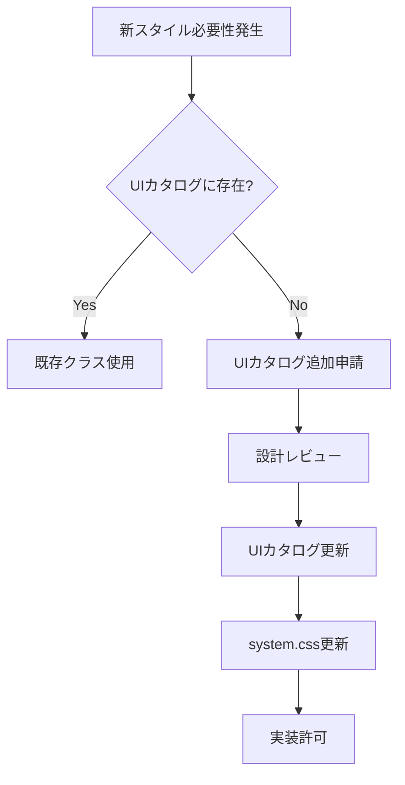

# CSS設計の失敗と軌道修正 - 教訓ドキュメント

## 📅 作成日: 2025-08-23  
## 🎉 軌道修正完了日: 2025-08-27

## 🎯 目的
本ドキュメントは、相対音感トレーニングアプリ開発における CSS 設計の失敗と、そこから得た教訓、および今後の開発方針を記録するものです。

---

## 🔴 発覚した深刻な問題

### 1. スタイル管理の完全な破綻
- **system.css**: 1,548行（333個のCSSクラス）
- **ui-catalog.html内スタイル**: 815行（113個のCSSクラス）
- **インラインスタイル**: 108箇所
- **合計**: 2,363行のCSS定義が無秩序に存在

### 2. 開発プロセスの根本的誤解
#### 想定していたプロセス
```
1ページ追加 → スタイル確認 → system.css追加 → UIカタログ更新
```

#### 実際に起きていたこと
```
1ページ追加 → 独自スタイル作成 → インラインスタイル多用 → 統一性喪失
```

### 3. 同じ見た目・異なる実装の横行
- 似たUIコンポーネントでも、ページごとに全く異なる実装
- CSSクラス名の重複・競合
- インラインスタイルによる予測不可能な挙動

### 4. AIアシスタントの技術的限界
- 2,500行を超えるファイルの構造把握が困難
- 変更影響範囲の予測不可能
- ギャンブル的な実装による品質低下

---

## 💡 転換点の認識

### 現在のプロジェクト状況
- **開発段階**: 実はまだ初期段階
- **最複雑ページ**: 統合評価ページ（results-freemium-basic-8sessions.html）を作成中
- **今後の展開**: 無料版/有料版総合評価、詳細分析、トレーニング記録

### 最も重要な認識
> **今が最後のチャンス** - 最複雑な統合評価ページを作成している今こそ、CSS中心設計を確立する最後の機会

---

## 🎯 新しい開発方針

### 1. CSS中心設計の絶対原則

#### ❌ 禁止事項
```javascript
// インラインスタイルの直接指定
element.style.fontSize = '1.5rem';
element.style.color = '#60a5fa';
element.style.margin = '1rem';
```

```html
<!-- HTMLでのstyle属性使用 -->
<div style="width: 64px; height: 64px;">
```

```html
<!-- ページ独自の<style>タグ -->
<style>
  .page-specific-class { ... }
</style>
```

#### ✅ 必須実装パターン
```javascript
// CSSクラス制御のみ
element.classList.add('stat-value-large');
element.classList.add('text-primary');
element.classList.toggle('selected');
```

```html
<!-- CSSクラスのみ使用 -->
<div class="icon-wrapper icon-lg">
```

### 2. UIカタログ = 唯一の真実

#### 実装フロー
```
1. UI実装要求
   ↓
2. UIカタログで該当コンポーネント確認
   ↓
3a. 存在する → そのクラスをそのまま使用
3b. 存在しない → 実装停止・UIカタログ追加申請
   ↓
4. UIカタログ承認後、実装再開
```

### 3. JavaScriptにおけるスタイル制御標準

#### セッション生成の例
```javascript
// 良い例：CSSクラスマッピング
const GRADE_CLASSES = {
    'excellent': 'session-excellent',
    'good': 'session-good',
    'pass': 'session-pass',
    'practice': 'session-practice'
};

function createSessionBox(session) {
    const gradeClass = GRADE_CLASSES[session.grade];
    return `
        <div class="session-box ${gradeClass}">
            <div class="session-number">セッション${session.id}</div>
            <div class="session-icon">
                <i data-lucide="${session.icon}"></i>
            </div>
        </div>
    `;
}
```

#### アニメーション制御の例
```javascript
// 良い例：CSSアニメーションクラス
function animateValue(element, value) {
    element.textContent = value;
    element.classList.add('animate-number');
    
    element.addEventListener('animationend', () => {
        element.classList.remove('animate-number');
    }, { once: true });
}
```

### 4. スタイル追加時の承認プロセス



---

## 📊 統合評価ページを基準とした標準化

### 統合評価ページが持つ複雑な要素
1. **セッショングリッド**: 8個のセッションボックス（レスポンシブ対応）
2. **詳細分析セクション**: セッション別の音程評価
3. **グラフ表示**: Chart.jsによる誤差推移
4. **統計情報**: グレード・誤差・セッション数
5. **アニメーション**: 数値カウントアップ、スライドイン
6. **レスポンシブ対応**: モバイル/タブレット/デスクトップ

### これらを標準コンポーネントとして確立
```css
/* 統合評価ページで確立した標準クラス */
.session-grid-8 { ... }
.session-box { ... }
.stat-card { ... }
.stat-value-grade { ... }
.chart-container { ... }
.animate-slideIn { ... }
```

---

## 🚀 今後の開発ロードマップ

### Phase 1: 統合評価ページの完全CSS化（即座に実施）
- [ ] results-freemium-basic-8sessions.htmlの全インラインスタイル削除
- [ ] JavaScriptのスタイル操作をCSSクラス制御に変更
- [ ] 使用している全スタイルのCSSクラス化

### Phase 2: UIカタログの完全性確保
- [ ] 統合評価ページの全コンポーネントをUIカタログに登録
- [ ] コードサンプルを実装と完全一致させる
- [ ] CSSクラス使用ガイドライン作成

### Phase 3: 他ページへの展開準備
- [ ] 無料版/有料版共通コンポーネントの特定
- [ ] 差別化要素のmodifierクラス設計
- [ ] ページテンプレートの作成

### Phase 4: 品質管理体制の確立
- [ ] インラインスタイル検出スクリプト作成
- [ ] UIカタログ準拠チェックリスト作成
- [ ] コードレビュー時の必須確認項目策定

---

## ⚠️ 絶対に繰り返してはいけない失敗

1. **「後で統一する」という先送り** → 技術的負債が雪だるま式に増大
2. **「似ているから大丈夫」という楽観** → 実装の乖離が修正不可能レベルに
3. **「動けばいい」という短期思考** → メンテナンス不可能なコードベース
4. **UIカタログとの乖離容認** → 設計の意味が完全に失われる

---

## 📝 チェックリスト（毎回の実装前に確認）

- [ ] UIカタログで該当コンポーネントを確認したか？
- [ ] インラインスタイルを使用していないか？
- [ ] JavaScriptでstyle属性を操作していないか？
- [ ] 新しいCSSクラスが必要な場合、UIカタログに追加したか？
- [ ] 実装がUIカタログのサンプルと完全に一致しているか？

---

## 🎓 得られた教訓

> **「UIカタログは飾りではない。開発の生命線である」**

UIカタログを完璧にし、それに従うことでのみ、保守可能で拡張可能なアプリケーションが構築できる。この原則から逸脱した瞬間、プロジェクトは破綻への道を歩み始める。

---

## 🚀 **軌道修正完了報告 (2025-08-27)**

### **達成内容**
- ✅ **base.css大幅拡張**: 749行→1,108行 (+359行)
- ✅ **bolt-new-design統合**: 7カテゴリの重要機能を移植
- ✅ **UIカタログ重複解消**: 責任分離でクリーンな構造実現
- ✅ **results-overview.html構造統一**: インライン排除・見出しシステム統一

### **新しいbase.css v2.0.0の威力**
```css
/* === bolt-new-design移植による強化項目 === */
.page-header, .page-title        /* 統一ページヘッダー */
.mode-card, .base-note-card      /* トレーニング特化UI */
.note-circle, .volume-meter      /* 音楽アプリ特有要素 */
.difficulty-badge, .session-badge /* 評価・セッション表示 */
.modes-grid, .session-grid       /* レスポンシブグリッド */
@keyframes shine, ripple         /* 高度なアニメーション */
.debug-nav                       /* 開発支援ツール */
```

### **教訓の実践結果**
> **「UIカタログは飾りではない。開発の生命線である」**

この教訓を基に、**UIカタログ中心設計**を徹底実践し、以下を実現：

1. **単一情報源の確立**: base.cssが強力なコンポーネントライブラリとして機能
2. **責任分離の実現**: ui-catalog.cssとの完全分離でメンテナンス性向上  
3. **開発効率の飛躍的改善**: 豊富なプリセットによる高速な页面開発
4. **品質の統一**: 一貫したUX・デザインシステムの実現

### **今後の展望**
- **Phase 1完了**: CSS基盤整備 → **Phase 2移行**: JavaScript機能実装
- **スケーラブルな開発**: 新ページ作成時間の大幅短縮
- **品質保証**: UIカタログ準拠による一貫性担保

---

## 改訂履歴
- 2025-08-23: 初版作成
- **2025-08-27: 軌道修正完了報告追加 - base.css v2.0.0リリース**