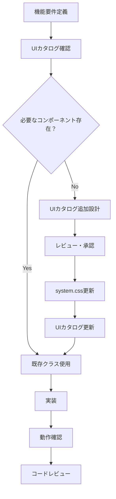
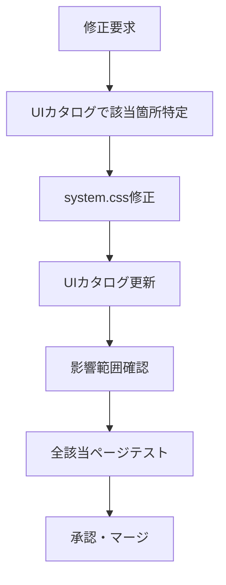

# CSS開発ガイドライン - 相対音感トレーニングアプリ

## 📅 策定日: 2025-08-23
## 📌 Version: 1.0.0

---

## 🎯 本ガイドラインの目的

統合評価ページ（results-freemium-basic-8sessions.html）の開発を通じて確立したCSS中心設計を、プロジェクト全体の標準として定義し、今後の開発における品質と効率を確保する。

---

## 🏗️ アーキテクチャ原則

### 1. UIカタログ駆動開発（UCD: UI Catalog Driven Development）

```
UIカタログ（ui-catalog.html）
    ↓ 唯一の真実の源泉（Single Source of Truth）
system.css
    ↓ UIカタログに基づくスタイル定義
各ページHTML
    ↓ UIカタログのクラスのみ使用
JavaScript
    ↓ CSSクラス操作のみ（style属性操作禁止）
```

### 2. レイヤー構造

```
┌─────────────────────────────────┐
│     UIカタログ（設計層）          │ ← すべての起点
├─────────────────────────────────┤
│     base.css（定義層）         │ ← スタイル定義
├─────────────────────────────────┤
│     HTML（構造層）               │ ← マークアップ
├─────────────────────────────────┤
│     JavaScript（振る舞い層）      │ ← クラス操作のみ
└─────────────────────────────────┘
```

---

## 📐 CSS設計原則

### 1. BEM変形命名規則

```css
/* ブロック */
.session-grid { }
.stat-card { }

/* ブロック__エレメント */
.session-grid__item { }
.stat-card__value { }

/* ブロック--モディファイア */
.session-grid--8cols { }
.stat-card--highlighted { }

/* 状態クラス（is-/has-プレフィックス） */
.is-selected { }
.has-error { }
```

### 2. コンポーネント粒度

#### 原子（Atoms）
```css
/* 最小単位のUI要素 */
.btn { }
.icon { }
.text-label { }
```

#### 分子（Molecules）
```css
/* 原子を組み合わせた小さな機能単位 */
.session-box { }
.stat-item { }
.nav-link { }
```

#### 有機体（Organisms）
```css
/* 分子を組み合わせた独立した機能ブロック */
.session-grid { }
.stats-dashboard { }
.analysis-section { }
```

### 3. レスポンシブ設計

```css
/* モバイルファースト */
.session-grid {
    grid-template-columns: repeat(4, 1fr); /* モバイル: 4列 */
}

@media (min-width: 768px) {
    .session-grid {
        grid-template-columns: repeat(8, 1fr); /* デスクトップ: 8列 */
    }
}
```

---

## 💻 JavaScript実装規則

### 1. DOM操作の標準パターン

#### ❌ 禁止：インラインスタイル操作（Lucideアイコンを除く）
```javascript
// 絶対禁止（Lucideアイコンのサイズ指定を除く）
element.style.display = 'none';
element.style.color = '#ff0000';
element.setAttribute('style', 'width: 100px');
```

#### ⚠️ 例外：Lucideアイコンのサイズ指定
```javascript
// Lucideアイコンのみ許可（表示問題のため）
// 試行錯誤の結果、インラインでないと正しく表示されないケースがある
<i data-lucide="crown" style="width: 64px; height: 64px;"></i>
<i data-lucide="trophy" style="width: 24px; height: 24px;"></i>

// ただし、可能な限り共通サイズはCSSクラス化を試みる
<i data-lucide="crown" class="icon-64"></i>  // 動作する場合
<i data-lucide="trophy" style="width: 24px; height: 24px;"></i>  // 動作しない場合
```

#### ✅ 必須：CSSクラス操作（Lucideアイコン以外）
```javascript
// 表示/非表示
element.classList.add('is-hidden');
element.classList.remove('is-hidden');

// 状態変更
element.classList.toggle('is-active');

// 複数クラス操作
element.classList.add('stat-value', 'text-primary', 'animate-fadeIn');
```

### 2. 動的コンテンツ生成

#### テンプレート関数の標準形
```javascript
// 定数定義（クラスマッピング）
const SESSION_CLASSES = {
    excellent: 'session-box--excellent',
    good: 'session-box--good',
    pass: 'session-box--pass',
    practice: 'session-box--practice'
};

// Lucideアイコンの標準サイズ定義
const ICON_SIZES = {
    sm: 'width: 16px; height: 16px;',
    md: 'width: 24px; height: 24px;',
    lg: 'width: 32px; height: 32px;',
    xl: 'width: 64px; height: 64px;'
};

// テンプレート関数
function createSessionBox(data) {
    const modifierClass = SESSION_CLASSES[data.grade] || '';
    
    return `
        <div class="session-box ${modifierClass}" data-session-id="${data.id}">
            <div class="session-box__number">
                セッション${data.id}
            </div>
            <div class="session-box__icon">
                <!-- Lucideアイコンはインラインスタイル必須 -->
                <i data-lucide="${data.icon}" style="${ICON_SIZES.md}"></i>
            </div>
            ${data.score ? `
                <div class="session-box__score">
                    ${data.score}
                </div>
            ` : ''}
        </div>
    `;
}
```

### 3. アニメーション制御

```javascript
// CSSアニメーションクラスを使用
function animateElement(element, animationClass) {
    element.classList.add(animationClass);
    
    element.addEventListener('animationend', () => {
        element.classList.remove(animationClass);
    }, { once: true });
}

// 使用例
animateElement(scoreElement, 'animate-slideIn');
```

---

## 🔄 開発フロー

### 1. 新機能実装フロー



### 2. スタイル修正フロー



---

## 📋 実装チェックリスト

### コンポーネント実装前
- [ ] UIカタログに該当コンポーネントが存在することを確認
- [ ] 使用するCSSクラスをリストアップ
- [ ] レスポンシブ対応要件を確認

### HTML実装時
- [ ] UIカタログのサンプルコードを基準に実装
- [ ] インラインstyle属性を使用していない
- [ ] 適切なセマンティックHTML要素を使用

### JavaScript実装時
- [ ] style属性の直接操作をしていない
- [ ] CSSクラスの追加/削除/切り替えのみ使用
- [ ] 動的生成HTMLもUIカタログ準拠

### 実装完了時
- [ ] すべてのブレークポイントで表示確認
- [ ] アニメーションの動作確認
- [ ] UIカタログとの一致確認

---

## 🚫 アンチパターン集

### 1. インラインスタイルの使用
```html
<!-- ❌ 絶対禁止 -->
<div style="margin-top: 20px; color: blue;">

<!-- ✅ 正しい実装 -->
<div class="mt-4 text-primary">
```

### 2. JavaScript でのスタイル操作
```javascript
// ❌ 絶対禁止
element.style.display = 'none';

// ✅ 正しい実装
element.classList.add('is-hidden');
```

### 3. ページ固有のスタイル定義
```html
<!-- ❌ 絶対禁止 -->
<style>
  .my-page-specific-style { ... }
</style>

<!-- ✅ 正しい実装 -->
<!-- UIカタログに追加 → system.cssに定義 → 使用 -->
```

### 4. 重複したコンポーネント実装
```javascript
// ❌ 各ページで独自実装
function myPageCreateSession() { ... }

// ✅ 共通関数を使用
import { createSessionBox } from './components/session.js';
```

---

## 📊 品質メトリクス

### 測定指標
1. **インラインスタイル数**: 0個を維持
2. **UIカタログ準拠率**: 100%
3. **CSSクラス重複率**: 5%以下
4. **未使用CSS**: 10%以下

### 監視方法
```bash
# インラインスタイル検出
grep -r "style=" ./Bolt/*.html

# JavaScript内のstyle操作検出
grep -r "\.style\." ./js/*.js

# 未使用CSS検出
# (専用ツールで定期チェック)
```

---

## 🔧 ツールとユーティリティ

### 推奨ツール
- **CSS Lint**: スタイル品質チェック
- **PurgeCSS**: 未使用CSS削除
- **Stylelint**: CSSコーディング規約チェック

### ヘルパー関数
```javascript
// utils/css-helpers.js
export const cssHelpers = {
    // 複数クラスの条件付き適用
    conditionalClasses(baseClass, conditions) {
        const classes = [baseClass];
        Object.entries(conditions).forEach(([className, condition]) => {
            if (condition) classes.push(className);
        });
        return classes.join(' ');
    },
    
    // アニメーション完了待機
    waitForAnimation(element, animationClass) {
        return new Promise(resolve => {
            element.classList.add(animationClass);
            element.addEventListener('animationend', resolve, { once: true });
        });
    }
};
```

---

## 📚 リファレンス

### 関連ドキュメント
- `CSS_ARCHITECTURE_LESSONS_LEARNED.md` - 失敗と教訓
- `ui-catalog.html` - UIコンポーネントカタログ
- `system.css` - スタイル定義

### 更新履歴
- 2025-08-23: v1.0.0 初版策定

---

## ⚡ クイックリファレンス

```javascript
// これだけ覚えれば大丈夫
const rules = {
    html: "UIカタログのクラスのみ使用",
    css: "新規作成前にUIカタログ確認",
    js: "classList操作のみ、style禁止",
    flow: "UIカタログ → system.css → 実装"
};
```

---

**本ガイドラインは、プロジェクトの成長とともに更新されます。**
**疑問がある場合は、UIカタログを確認することから始めてください。**