# 音域テストフロー図

**ファイル**: preparation-test.html  
**作成日**: 2025年1月9日  
**目的**: 音域テスト完全フロー可視化図

---

## 🎯 全体フロー概要

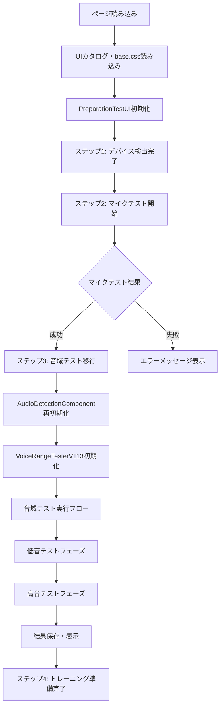

---

## 🔄 AudioDetectionComponent初期化フロー

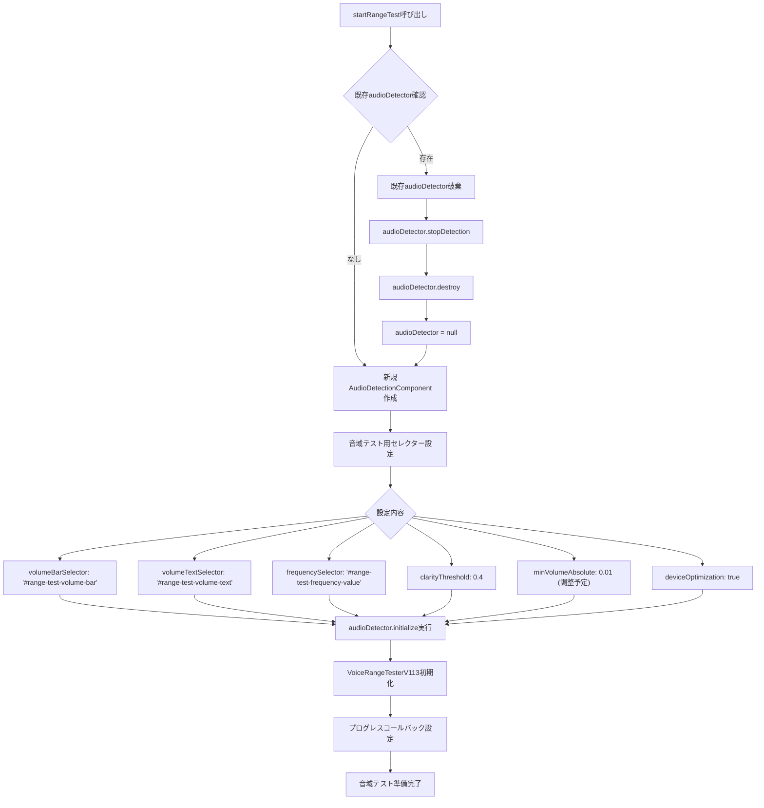

---

## 🎵 VoiceRangeTesterV113動作フロー

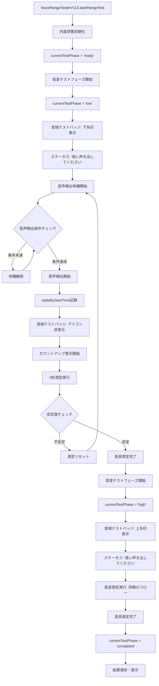

---

## 🎯 音域テストバッジ更新フロー

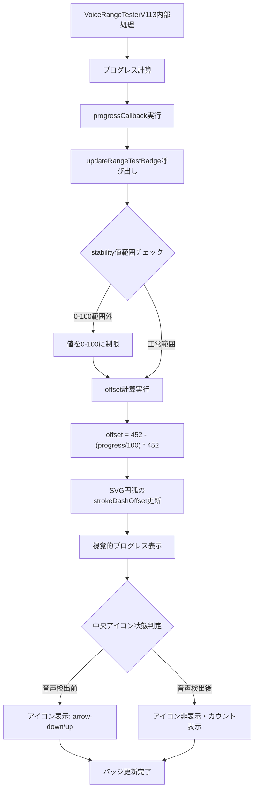

---

## 🔄 コールバック連携フロー

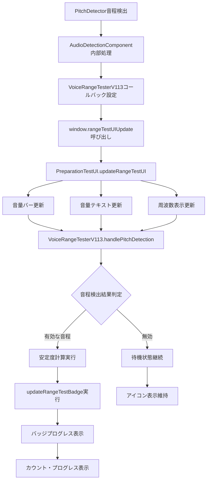

---

## 🎤 音声検出判定フロー

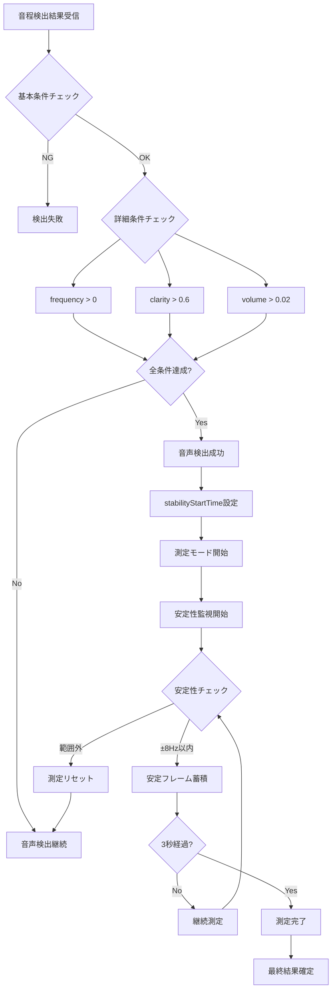

---

## 📱 デバイス最適化フロー

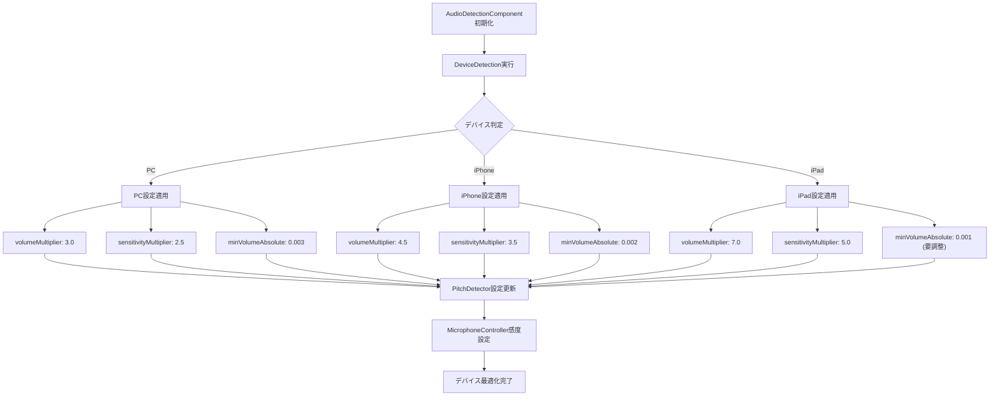

---

## ⚠️ エラーハンドリングフロー

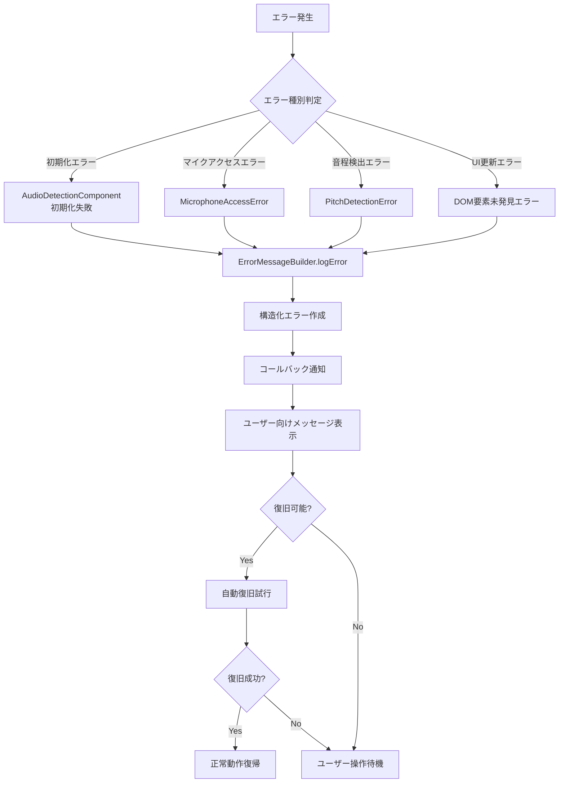

---

## 🔧 リソース管理フロー

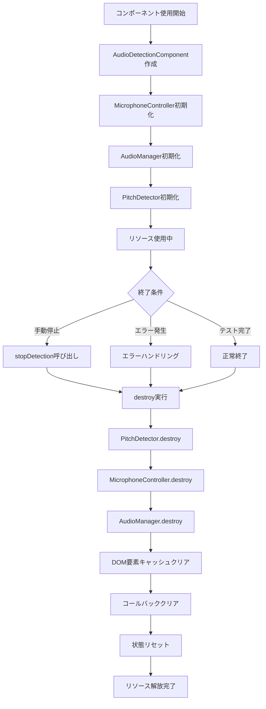

---

## 📋 データフローとUI連携

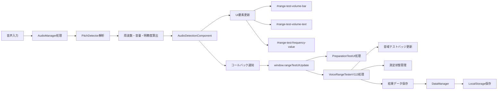

---

## 🎯 クリーンアップ対象の特定

### 削除すべき古いコード
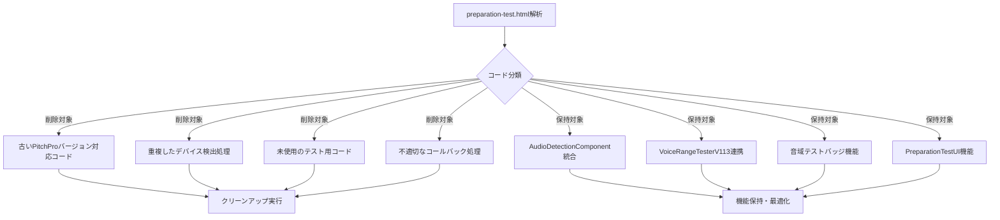

---

## 🚀 実装優先度マップ

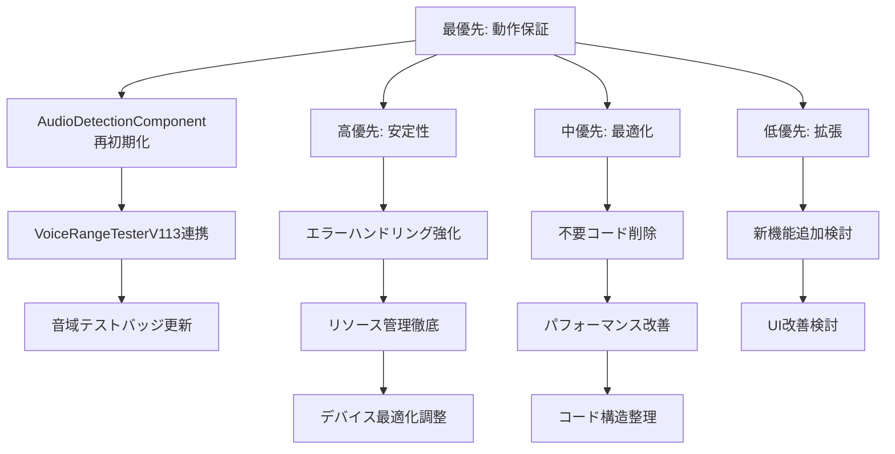

---

**このフロー図を基準にクリーンアップ作業を実行する**