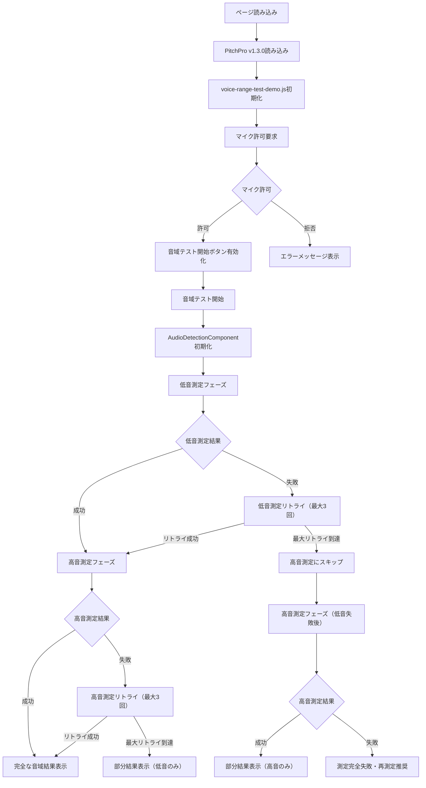
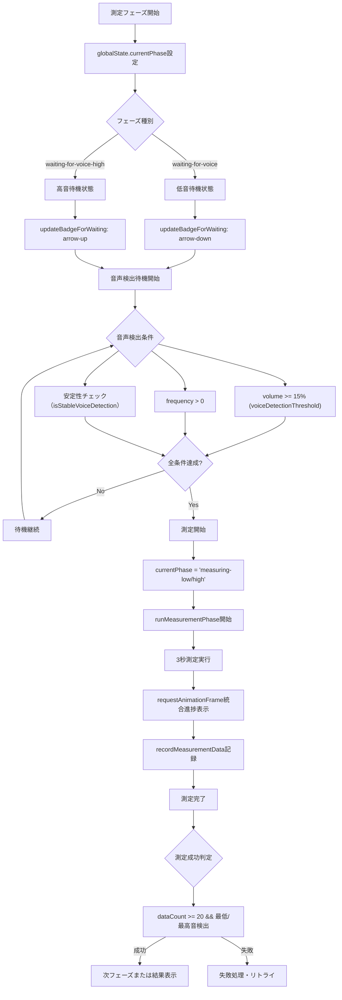
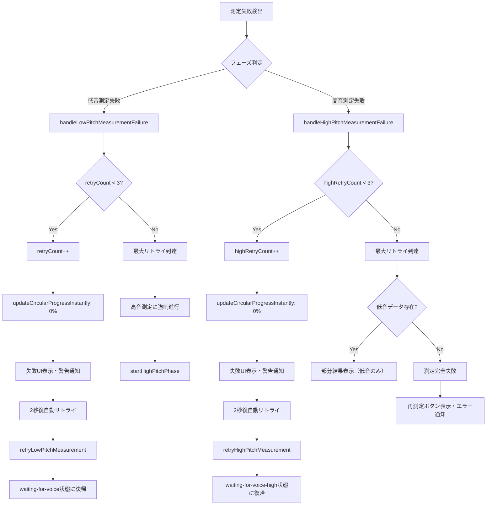
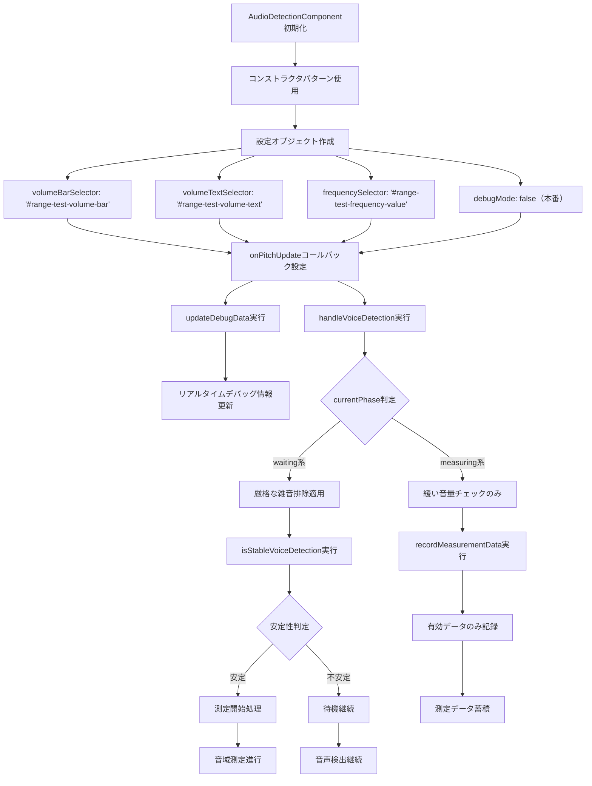
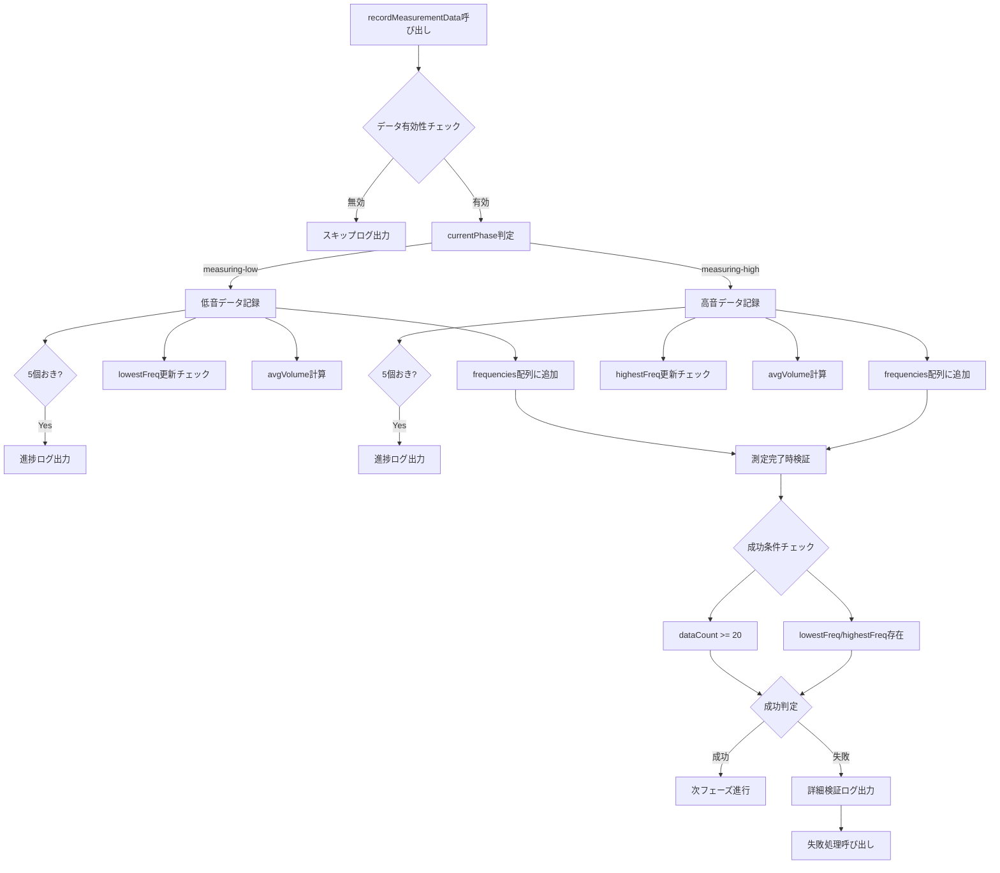
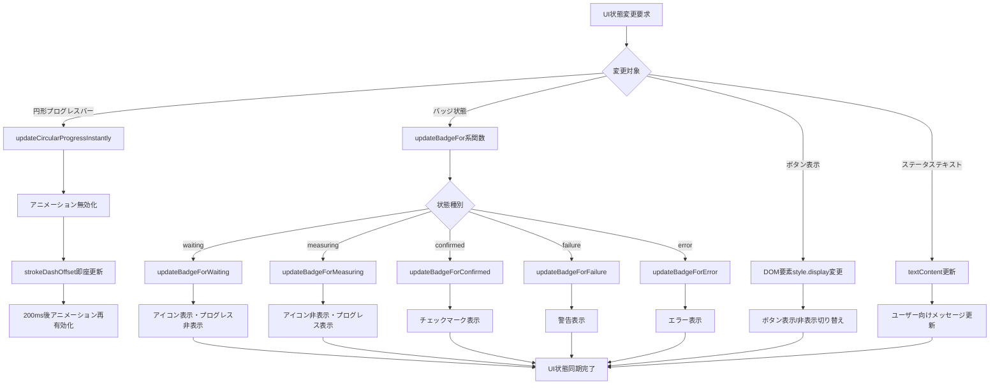
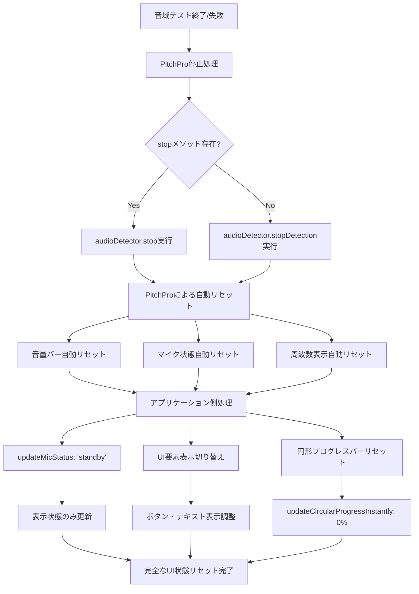
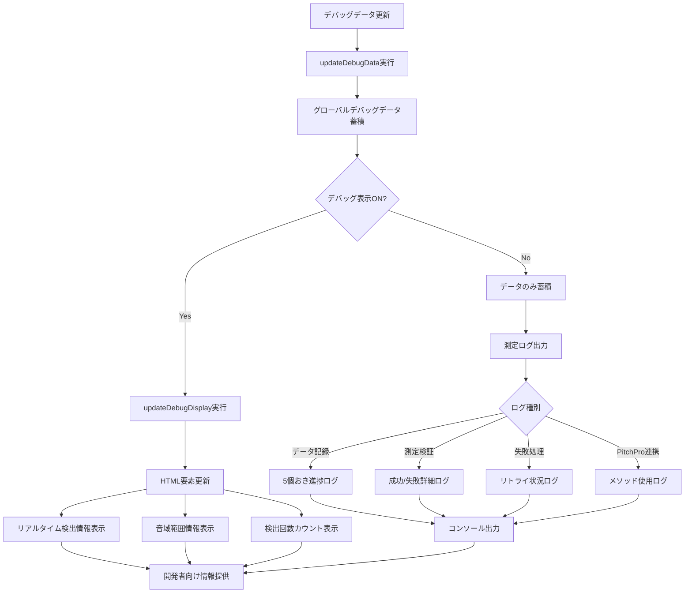
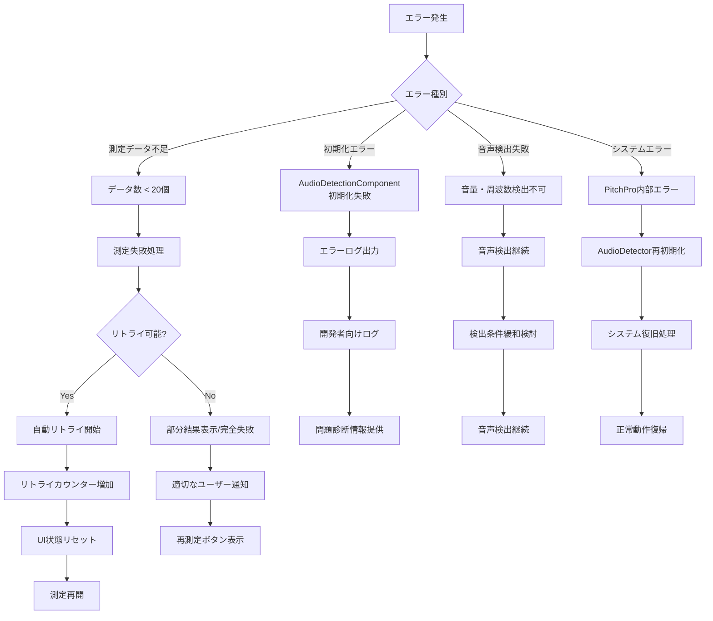
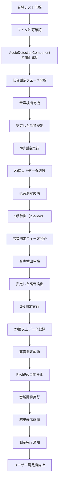

# 音域テストフロー図 v2.0.0

**ファイル**: voice-range-test-v4
**更新日**: 2025年1月21日
**目的**: 音域テスト最新実装フロー可視化図
**対象**: PitchPro v1.3.0統合版・測定失敗ハンドリング・リトライ機能完備版

---

## 🎯 全体フロー概要

---

## 🔄 測定フェーズ詳細フロー

---

## 🎯 測定失敗ハンドリングフロー

---

## 🔄 PitchPro v1.3.0統合フロー

---

## 📊 データ記録・検証フロー

---

## 🎨 UI状態管理フロー

---

## 🔄 PitchProメソッド活用フロー

---

## 🧪 デバッグ・ログフロー

---

## ⚠️ エラーハンドリング詳細フロー

---

## 🎯 成功シナリオフロー

---

## 📋 実装状況サマリー

### ✅ 完了済み機能
- PitchPro v1.3.0統合（コンストラクタパターン）
- 最小データ数要件（20個）による厳格な成功判定
- 低音・高音測定の独立したリトライシステム（各最大3回）
- 円形プログレスバーの即座リセット機能
- PitchProメソッドを活用したUI状態管理
- 詳細なログ出力・デバッグ機能

### 🔄 現在の動作フロー
1. **初期化**: AudioDetectionComponent作成・設定
2. **低音測定**: 待機→検出→測定→検証→成功/リトライ
3. **高音測定**: 待機→検出→測定→検証→成功/リトライ
4. **結果表示**: 完全結果/部分結果/失敗表示
5. **クリーンアップ**: PitchPro停止・UI状態リセット

### 🎯 技術的特徴
- **責任分離**: PitchPro（音声処理）+ アプリ（UI状態管理）
- **堅牢性**: 多層的エラーハンドリング・自動リトライ
- **ユーザビリティ**: 明確な進捗表示・詳細なフィードバック
- **保守性**: 構造化されたデバッグ・ログシステム

---

**Version**: 2.0.0
**Last Updated**: 2025年1月21日
**Based on**: voice-range-test-v4実装 + 測定失敗ハンドリング + リトライ機能