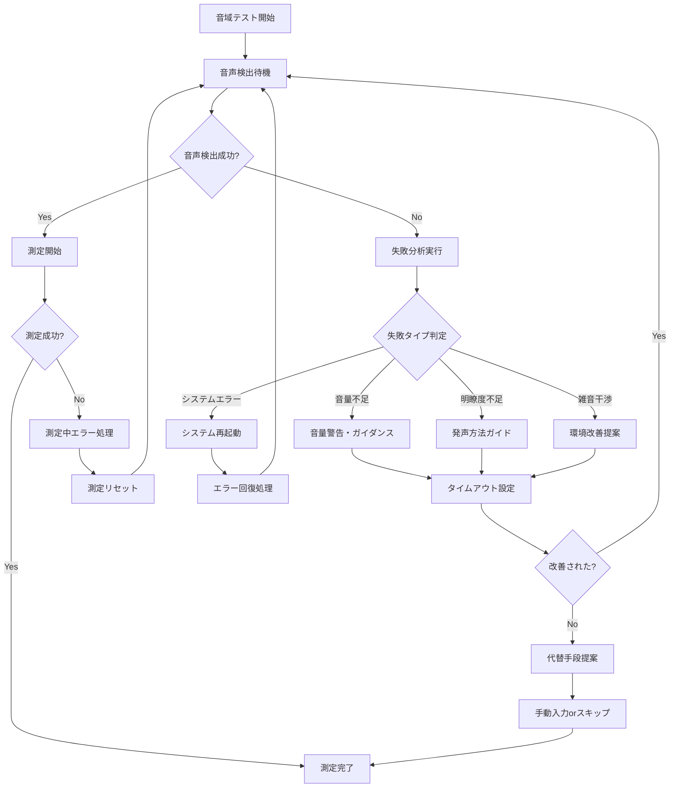

# 測定失敗時挙動・エラーハンドリング設計書

**作成日**: 2025年1月9日  
**目的**: 音域テスト測定失敗時の包括的な挙動とエラーハンドリング設計  
**対象**: 確実なユーザー体験の提供

---

## 🚨 測定失敗パターンの分析

### **1. 音声検出失敗**

#### **パターンA: 声が小さすぎる**
```javascript
// 検出条件
result.frequency > 0 && result.clarity > 0.6 && result.volume > 0.02

// 失敗ケース
result.volume <= 0.02  // 音量が2%以下
```

**症状**:
- 音域テストバッジの中央アイコンが矢印のまま
- カウントアップが始まらない
- 「声を検出すると3秒測定が始まります」のまま

**対処法**:
```javascript
// 音量不足検出
if (result.volume > 0.005 && result.volume <= 0.02) {
    updateSubInfo('声が小さすぎます。もう少し大きく話してください');
    updateMainStatus('音量を上げてください');
    showVolumeWarningAnimation();
}
```

#### **パターンB: 音程が不明瞭**
```javascript
// 失敗ケース
result.clarity <= 0.6  // 明瞭度が60%以下
```

**症状**:
- 音量バーは動くが測定が開始されない
- 周波数が不安定に変動

**対処法**:
```javascript
// 明瞭度不足検出
if (result.frequency > 0 && result.clarity <= 0.6) {
    updateSubInfo('はっきりと「あ」で発声してください');
    updateMainStatus('音程をより明瞭に');
    showClarityWarningAnimation();
}
```

#### **パターンC: 雑音・背景音**
```javascript
// 失敗ケース
result.frequency === 0 && result.volume > 0.01  // 音量はあるが周波数検出できない
```

**症状**:
- 音量バーは動くが周波数が0Hz
- 雑音を拾っている状態

**対処法**:
```javascript
// 雑音検出
if (result.volume > 0.01 && result.frequency === 0) {
    updateSubInfo('周囲の雑音を減らしてください');
    updateMainStatus('静かな環境で再試行');
    showNoiseWarningAnimation();
}
```

### **2. 測定中断・不安定**

#### **パターンD: 途中で音声が途切れる**
```javascript
// 検出中に音声停止
voiceDetectionStarted === true && result.frequency === 0
```

**症状**:
- カウントアップ中に音声が検出されなくなる
- プログレスバーが進まない

**対処法**:
```javascript
// 音声途切れ検出
function handleVoiceInterruption() {
    // 測定リセット
    resetMeasurement();
    
    // UI復旧
    showRangeIcon(currentTestPhase); // 元のアイコンに戻る
    updateSubInfo('音声が途切れました。もう一度お試しください');
    updateMainStatus('継続して発声してください');
    
    // カウントダウン非表示
    hideCountdownDisplay();
    
    // プログレスリセット
    updateRangeTestBadge(0);
}
```

#### **パターンE: 音程が不安定（±8Hz超過）**
```javascript
// 不安定検出
Math.abs(currentFreq - lastFreq) > 8  // 8Hz以上の変動
```

**症状**:
- カウントアップが何度もリセットされる
- 測定が完了しない

**対処法**:
```javascript
// 音程不安定対応
function handlePitchInstability(attempts) {
    if (attempts >= 3) {
        // 3回失敗で緩和措置
        updateSubInfo('安定した音程で発声してください（許容範囲を拡大中）');
        adjustStabilityThreshold(12); // ±8Hz → ±12Hzに緩和
    } else {
        updateSubInfo('音程を安定させてください');
        updateMainStatus('一定の音程を保ってください');
    }
}
```

### **3. システムレベルエラー**

#### **パターンF: マイクアクセス失敗**
```javascript
// AudioDetectionComponent初期化失敗
audioDetector.initialize() // throws MicrophoneAccessError
```

**対処法**:
```javascript
function handleMicrophoneError(error) {
    updateMainStatus('マイクアクセスエラー');
    updateSubInfo('ブラウザ設定でマイクを許可してください');
    updateMicStatus('error');
    
    showErrorRecoveryOptions();
    disableRangeTestButton();
}
```

#### **パターンG: AudioDetectionComponent不具合**
```javascript
// PitchPro内部エラー
audioDetector.startDetection() === false
```

**対処法**:
```javascript
function handleDetectionSystemError() {
    updateMainStatus('音声検出システムエラー');
    updateSubInfo('ページを再読み込みしてください');
    
    showSystemErrorAnimation();
    enableRetryButton();
}
```

---

## 🔄 失敗時の包括的フロー設計

### **失敗検出・分類システム**

```javascript
/**
 * 測定失敗の包括的検出・分類
 * @param {Object} result - PitchDetection結果
 * @param {Object} state - 現在の測定状態
 */
function analyzeFailureReason(result, state) {
    const failureAnalysis = {
        type: null,
        reason: null,
        message: null,
        subMessage: null,
        recoveryAction: null,
        animation: null
    };
    
    // 1. システムレベルエラー（最優先）
    if (!result) {
        failureAnalysis.type = 'system_error';
        failureAnalysis.reason = 'no_audio_data';
        failureAnalysis.message = '音声システムエラー';
        failureAnalysis.subMessage = 'マイクの接続を確認してください';
        failureAnalysis.recoveryAction = 'restart_system';
        failureAnalysis.animation = 'error_pulse';
        return failureAnalysis;
    }
    
    // 2. 音声検出失敗
    if (result.volume <= 0.005) {
        failureAnalysis.type = 'volume_too_low';
        failureAnalysis.reason = 'insufficient_volume';
        failureAnalysis.message = '音量が不足しています';
        failureAnalysis.subMessage = 'マイクに近づいて話してください';
        failureAnalysis.recoveryAction = 'increase_volume';
        failureAnalysis.animation = 'volume_warning';
        return failureAnalysis;
    }
    
    if (result.volume > 0.005 && result.volume <= 0.02) {
        failureAnalysis.type = 'volume_low';
        failureAnalysis.reason = 'weak_voice';
        failureAnalysis.message = '声が小さすぎます';
        failureAnalysis.subMessage = 'もう少し大きく話してください';
        failureAnalysis.recoveryAction = 'encourage_louder';
        failureAnalysis.animation = 'volume_boost';
        return failureAnalysis;
    }
    
    // 3. 音程検出失敗
    if (result.frequency === 0 && result.volume > 0.01) {
        failureAnalysis.type = 'noise_interference';
        failureAnalysis.reason = 'background_noise';
        failureAnalysis.message = '雑音が検出されています';
        failureAnalysis.subMessage = '静かな環境で再試行してください';
        failureAnalysis.recoveryAction = 'reduce_noise';
        failureAnalysis.animation = 'noise_warning';
        return failureAnalysis;
    }
    
    if (result.frequency > 0 && result.clarity <= 0.6) {
        failureAnalysis.type = 'clarity_insufficient';
        failureAnalysis.reason = 'unclear_pitch';
        failureAnalysis.message = '音程が不明瞭です';
        failureAnalysis.subMessage = 'はっきりと「あ」で発声してください';
        failureAnalysis.recoveryAction = 'improve_clarity';
        failureAnalysis.animation = 'clarity_guide';
        return failureAnalysis;
    }
    
    // 4. 測定中の問題
    if (state.isCollectingData && result.frequency === 0) {
        failureAnalysis.type = 'voice_interrupted';
        failureAnalysis.reason = 'voice_break';
        failureAnalysis.message = '音声が途切れました';
        failureAnalysis.subMessage = '継続して発声してください';
        failureAnalysis.recoveryAction = 'restart_measurement';
        failureAnalysis.animation = 'interruption_warning';
        return failureAnalysis;
    }
    
    // 5. 音程不安定
    if (state.isCollectingData && Math.abs(result.frequency - state.lastFrequency) > 8) {
        failureAnalysis.type = 'pitch_unstable';
        failureAnalysis.reason = 'frequency_variation';
        failureAnalysis.message = '音程が不安定です';
        failureAnalysis.subMessage = '一定の音程を保ってください';
        failureAnalysis.recoveryAction = 'stabilize_pitch';
        failureAnalysis.animation = 'stability_guide';
        return failureAnalysis;
    }
    
    // 正常状態
    failureAnalysis.type = 'normal';
    return failureAnalysis;
}
```

### **失敗時の統合対応システム**

```javascript
/**
 * 失敗検出時の統合対応処理
 * @param {Object} failureAnalysis - 失敗分析結果
 */
function handleMeasurementFailure(failureAnalysis) {
    console.log(`⚠️ 測定失敗検出: ${failureAnalysis.type} - ${failureAnalysis.reason}`);
    
    // 1. 測定状態の適切な処理
    switch (failureAnalysis.type) {
        case 'voice_interrupted':
        case 'pitch_unstable':
            // 測定リセット（データは保持）
            resetCurrentMeasurement();
            break;
            
        case 'volume_too_low':
        case 'clarity_insufficient':
        case 'noise_interference':
            // 待機状態に戻る
            returnToWaitingState();
            break;
            
        case 'system_error':
            // システム再起動
            restartDetectionSystem();
            break;
    }
    
    // 2. UI状態更新
    updateMainStatus(failureAnalysis.message);
    updateSubInfo(failureAnalysis.subMessage);
    
    // 3. アニメーション実行
    executeFailureAnimation(failureAnalysis.animation);
    
    // 4. 回復アクション提示
    showRecoveryAction(failureAnalysis.recoveryAction);
    
    // 5. 失敗統計記録
    recordFailureStatistics(failureAnalysis.type);
    
    // 6. タイムアウト設定
    setFailureTimeout(failureAnalysis.type);
}

/**
 * 測定リセット処理
 */
function resetCurrentMeasurement() {
    // VoiceRangeTesterV113の測定データをリセット
    if (voiceRangeTester) {
        voiceRangeTester.resetCurrentMeasurement();
    }
    
    // UI要素をリセット
    updateRangeTestBadge(0);
    hideCountdownDisplay();
    showRangeIcon(getCurrentTestPhase());
    
    // 測定変数リセット
    voiceDetectionStarted = false;
    stabilityStartTime = null;
    stableFrequencies = [];
}

/**
 * 待機状態復帰処理
 */
function returnToWaitingState() {
    // 完全に初期状態に戻る
    resetCurrentMeasurement();
    updateMicStatus('standby');
    
    // 再試行準備
    enableRetryAction();
}
```

---

## 🎨 失敗時のアニメーション・視覚フィードバック

### **音量不足警告アニメーション**
```css
.volume-warning {
    animation: volumeBoost 2s ease-in-out infinite;
}

@keyframes volumeBoost {
    0%, 100% { transform: scale(1); opacity: 1; }
    50% { transform: scale(1.1); opacity: 0.8; }
}

.mic-status-container.volume-warning {
    background: linear-gradient(135deg, #f59e0b, #d97706);
    animation: pulseWarning 1.5s ease-in-out infinite;
}
```

### **音程不安定警告アニメーション**
```css
.pitch-unstable {
    animation: pitchShake 0.5s ease-in-out 3;
}

@keyframes pitchShake {
    0%, 100% { transform: translateX(0); }
    25% { transform: translateX(-5px); }
    75% { transform: translateX(5px); }
}
```

### **エラー状態アニメーション**
```css
.error-pulse {
    animation: errorPulse 1s ease-in-out infinite;
}

@keyframes errorPulse {
    0%, 100% { 
        background: rgba(239, 68, 68, 0.2);
        border-color: #ef4444;
    }
    50% { 
        background: rgba(239, 68, 68, 0.4);
        border-color: #dc2626;
        transform: scale(1.02);
    }
}
```

---

## ⏱️ タイムアウト・自動回復システム

### **段階的タイムアウト**
```javascript
const timeoutConfig = {
    'volume_too_low': {
        warningTimeout: 10000,    // 10秒で警告強化
        giveupTimeout: 30000,     // 30秒で諦め提案
        message: '音量の調整に時間がかかっています'
    },
    'clarity_insufficient': {
        warningTimeout: 15000,    // 15秒で発声方法ガイド
        giveupTimeout: 45000,     // 45秒で環境変更提案
        message: '音程検出に時間がかかっています'
    },
    'pitch_unstable': {
        warningTimeout: 20000,    // 20秒で閾値緩和
        giveupTimeout: 60000,     // 60秒で手動入力提案
        message: '音程の安定化に時間がかかっています'
    }
};

function setFailureTimeout(failureType) {
    const config = timeoutConfig[failureType];
    if (!config) return;
    
    // 警告タイマー
    setTimeout(() => {
        showExtendedGuidance(failureType);
    }, config.warningTimeout);
    
    // 諦めタイマー
    setTimeout(() => {
        offerAlternativeMethod(failureType);
    }, config.giveupTimeout);
}
```

### **代替手段の提案**
```javascript
function offerAlternativeMethod(failureType) {
    const alternatives = {
        'volume_too_low': {
            title: 'マイク設定の確認',
            actions: ['システム音量の確認', 'マイクの距離調整', '手動音域入力']
        },
        'clarity_insufficient': {
            title: '環境の改善',
            actions: ['静かな場所への移動', 'マイクの変更', 'スキップして継続']
        },
        'pitch_unstable': {
            title: '測定方法の変更',
            actions: ['より長い音での測定', '楽器での音出し', '概算値での継続']
        }
    };
    
    const alternative = alternatives[failureType];
    if (alternative) {
        showAlternativeDialog(alternative.title, alternative.actions);
    }
}
```

---

## 📊 失敗統計とフィードバック改善

### **失敗データの記録**
```javascript
const failureStatistics = {
    volume_too_low: 0,
    clarity_insufficient: 0,
    pitch_unstable: 0,
    noise_interference: 0,
    voice_interrupted: 0,
    system_error: 0
};

function recordFailureStatistics(failureType) {
    failureStatistics[failureType]++;
    
    // LocalStorage保存
    localStorage.setItem('voiceRangeFailureStats', JSON.stringify(failureStatistics));
    
    // 改善提案の判定
    analyzeFailurePatterns();
}

function analyzeFailurePatterns() {
    const total = Object.values(failureStatistics).reduce((a, b) => a + b, 0);
    
    if (total > 5) {
        const mostFrequent = Object.entries(failureStatistics)
            .sort(([,a], [,b]) => b - a)[0];
        
        suggestEnvironmentImprovement(mostFrequent[0]);
    }
}
```

---

## 🔄 エラー回復フロー統合

### **完全なエラーハンドリングフロー**


---

## ✅ 実装チェックリスト

### **必須実装項目**
- [ ] 音量不足検出と警告システム
- [ ] 明瞭度不足検出とガイダンス
- [ ] 雑音干渉検出と環境改善提案
- [ ] 音声途切れ検出と測定リセット
- [ ] 音程不安定検出と安定化ガイド
- [ ] システムエラー検出と自動回復
- [ ] 段階的タイムアウトシステム
- [ ] 代替手段提案機能
- [ ] 失敗統計記録と分析
- [ ] 包括的エラー回復フロー

### **UI・UX項目**
- [ ] 失敗理由の明確な表示
- [ ] 視覚的なエラーフィードバック
- [ ] 回復アクションの具体的提示
- [ ] 進捗維持（部分成功の保存）
- [ ] ユーザーのモチベーション維持

---

**この包括的なエラーハンドリングで、測定失敗時も安心のユーザー体験を提供する**