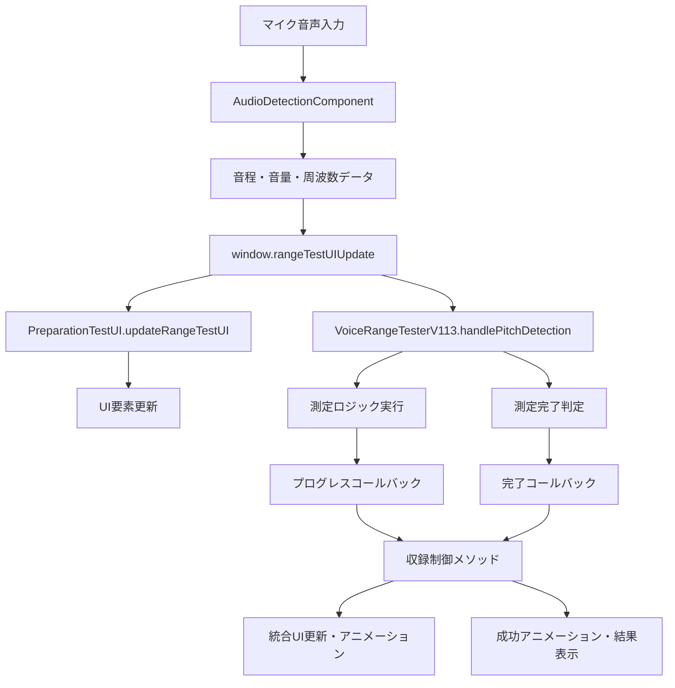

# PitchPro役割分担明確化書

**作成日**: 2025年1月9日  
**目的**: PitchProの仕様理解と各コンポーネントの役割分担明確化  
**対象**: preparation-test.html実装での適切な役割分担

---

## 🎯 PitchProアーキテクチャ理解

### **階層構造**
```
📦 PitchPro Audio Processing Library
├── 🎤 統合インターフェース層
│   ├── AudioDetectionComponent（推奨）
│   └── MicrophoneController
├── 🔧 コア処理層  
│   ├── AudioManager
│   ├── PitchDetector  
│   └── MicrophoneLifecycleManager
├── 🛠️ ユーティリティ層
│   ├── DeviceDetection
│   ├── NoiseFilter
│   └── FrequencyUtils
└── 🎵 高度処理層
    ├── HarmonicCorrection
    └── VoiceAnalyzer
```

---

## 🔍 現在のpreparation-test.html実装状況

### **使用中のPitchProコンポーネント**
```javascript
// 1. AudioDetectionComponent（統合音声検出UI連携）
const audioDetector = new AudioDetectionComponent({
    volumeBarSelector: '#range-test-volume-bar',
    volumeTextSelector: '#range-test-volume-text',
    frequencySelector: '#range-test-frequency-value',
    clarityThreshold: 0.4,
    minVolumeAbsolute: 0.01,
    deviceOptimization: true,
    debug: true,
    logPrefix: '🎵 RangeTest'
});

// 2. VoiceRangeTesterV113（自社開発）
const voiceRangeTester = new VoiceRangeTesterV113({
    audioDetector: audioDetector,
    dataManager: dataManager
});
```

### **既存の問題点**
1. **役割の重複**: AudioDetectionComponentとVoiceRangeTesterV113で音声処理が重複
2. **UI制御の分散**: 複数のコンポーネントが同じUI要素を更新
3. **状態管理の不統一**: 収録状態の管理が複数箇所に分散

---

## 🎯 適切な役割分担の提案

### **1. AudioDetectionComponent（PitchPro統合）**

#### **役割**
- **音声入力・処理の核心**
- **デバイス最適化の自動適用**
- **基本的なUI要素の更新**

#### **責任範囲**
```javascript
// ✅ AudioDetectionComponentが担当すべき処理
- マイクロフォンリソースの管理
- 音程・音量・周波数の検出
- 基本UI要素の更新（音量バー、周波数表示等）
- デバイス別最適化の自動適用
- エラーハンドリングと自動復旧
- AudioContext・MediaStreamの管理
```

#### **推奨設定**
```javascript
const audioDetector = new AudioDetectionComponent({
    // UI要素セレクター
    volumeBarSelector: '#current-volume-bar',
    volumeTextSelector: '#current-volume-text',
    frequencySelector: '#current-frequency-value',
    
    // 音程検出設定（PitchProデフォルト値使用）
    clarityThreshold: 0.4,        // 40% - 実用的な信頼性閾値
    minVolumeAbsolute: 0.003,     // 0.3% - 適切な最小音量
    fftSize: 4096,                // 高精度FFT
    smoothing: 0.1,               // 最小限の平滑化
    
    // システム設定
    deviceOptimization: true,     // 自動デバイス最適化
    autoUpdateUI: true,           // 自動UI更新
    debug: true,                  // デバッグログ
    logPrefix: '🎵 AudioDetection'
});

// 重要：一度初期化したら使い回す
await audioDetector.initialize();
```

### **2. 収録制御メソッド（新規作成）**

#### **役割**
- **音域テストの収録フロー制御**
- **UI状態の統合管理**
- **アニメーション・エフェクトの制御**

#### **責任範囲**
```javascript
// ✅ 収録制御メソッドが担当すべき処理
- 収録開始・停止の統合制御
- マイクアイコンの状態・アニメーション管理
- 音域テストバッジの状態・アニメーション管理
- メインステータス・サブ情報の表示制御
- VoiceRangeTesterV113との連携制御
- 測定完了時の成功アニメーション実行
```

#### **実装例**
```javascript
// 収録制御の統合メソッド
function startRecording(testType) {
    console.log(`🎤 収録開始: ${testType}音テスト`);
    
    // 1. AudioDetectionComponentで音声処理開始
    if (audioDetector) {
        audioDetector.startDetection();
    }
    
    // 2. UI状態更新
    updateMainStatus(testType === 'low' ? 'できるだけ低い声を出してください' : 'できるだけ高い声を出してください');
    updateSubInfo('声を検出すると3秒測定が始まります');
    updateMicStatus('recording'); // 赤背景+パルスアニメーション
    
    // 3. 音域テストバッジ初期化
    resetRangeTestBadge(testType);
    
    // 4. VoiceRangeTesterV113に測定開始を指示
    if (voiceRangeTester) {
        voiceRangeTester.startTest(testType);
    }
}
```

### **3. VoiceRangeTesterV113（音域測定ロジック）**

#### **役割**
- **音域測定の専門ロジック**
- **測定データの管理・計算**
- **測定完了判定**

#### **責任範囲の再定義**
```javascript
// ✅ VoiceRangeTesterV113が担当すべき処理
- 低音・高音の測定ロジック
- 3秒安定度測定の実行
- 音域データの計算・保存
- 測定完了の判定
- プログレスコールバックの提供
- LocalStorageへのデータ保存
```

#### **❌ VoiceRangeTesterV113から除外すべき処理**
```javascript
// ❌ これらはVoiceRangeTesterV113の責任外
- UI要素の直接操作 → 収録制御メソッドに移管
- AudioDetectionComponentの制御 → 収録制御メソッドに移管  
- マイクアイコンの状態管理 → 収録制御メソッドに移管
- アニメーション実行 → 収録制御メソッドに移管
```

### **4. PreparationTestUI（DOM管理）**

#### **役割**
- **DOM要素の効率的キャッシュ**
- **UI更新の最適化**

#### **責任範囲**
```javascript
// ✅ PreparationTestUIが担当すべき処理  
- DOM要素の一元キャッシュ管理
- UI更新処理の最適化
- 重複したDOM操作の防止
- 効率的なバッチ更新処理
```

---

## 🔄 データフローの明確化

### **正しいデータフロー**


### **統一されたコールバック設計**
```javascript
// 1. AudioDetectionComponentの設定
audioDetector.setCallbacks({
    onPitchUpdate: (result) => {
        // 统一コールバック経由でデータ配布
        if (window.rangeTestUIUpdate) {
            window.rangeTestUIUpdate(result);
        }
    },
    onError: (error) => {
        handleAudioError(error);
    }
});

// 2. 統一コールバック関数
window.rangeTestUIUpdate = function(result) {
    // PreparationTestUIでUI更新
    preparationUI.updateRangeTestUI(result);
    
    // VoiceRangeTesterV113で測定処理
    if (voiceRangeTester && isRecording()) {
        voiceRangeTester.handlePitchDetection(result);
    }
};

// 3. VoiceRangeTesterV113のコールバック設定
voiceRangeTester.setCallbacks({
    onProgressUpdate: (progress) => {
        // 収録制御メソッド経由でバッジ更新
        updateRangeTestBadge(progress);
    },
    onMeasurementComplete: (testType, result) => {
        // 収録制御メソッド経由で完了処理
        stopRecording('completed', { testType, result });
    }
});
```

---

## 📋 実装上の重要な原則

### **1. 単一責任の原則**
```javascript
// ✅ 良い例：各コンポーネントが明確な責任を持つ
AudioDetectionComponent: 音声処理専門
VoiceRangeTesterV113: 測定ロジック専門
収録制御メソッド: UI制御・フロー管理専門

// ❌ 悪い例：責任が曖昧
VoiceRangeTesterV113がUI制御も音声処理も担当
```

### **2. データ流れの一元化**
```javascript
// ✅ 統一されたデータフロー
マイク入力 → AudioDetectionComponent → 統一コールバック → 各処理コンポーネント

// ❌ 分散したデータフロー  
複数のコンポーネントが直接AudioDetectionComponentを操作
```

### **3. UI制御の統合**
```javascript
// ✅ 収録制御メソッドによる統合制御
updateRecordingUI(state) {
    updateMicStatus(state);
    updateRangeTestBadge(state); 
    updateMainStatus(getMessage(state));
    updateSubInfo(getSubMessage(state));
}

// ❌ 分散したUI制御
複数のコンポーネントが同じUI要素を直接操作
```

### **4. PitchProの適切な活用**
```javascript
// ✅ PitchProの推奨使用方法
const audioDetector = new AudioDetectionComponent({
    // PitchProが最適化したデフォルト値を使用
    clarityThreshold: 0.4,      // 40% - 実用的な信頼性閾値
    minVolumeAbsolute: 0.003,   // 0.3% - 適切な最小音量
    deviceOptimization: true,   // 自動デバイス最適化
    autoUpdateUI: true         // 自動UI更新
});

// 一度初期化したら使い回し、セレクター変更で対応
audioDetector.updateSelectors({
    volumeBarSelector: '#new-volume-bar'
});

// ❌ 非推奨：複数インスタンスの作成
const detector1 = new AudioDetectionComponent({...});
const detector2 = new AudioDetectionComponent({...}); // リソース競合
```

---

## 🚀 実装計画への影響

### **既存実装の修正方針**

#### **1. AudioDetectionComponent（変更最小）**
```javascript
// 現在の設定を維持、追加設定のみ
const audioDetector = new AudioDetectionComponent({
    volumeBarSelector: '#range-test-volume-bar',
    volumeTextSelector: '#range-test-volume-text',
    frequencySelector: '#range-test-frequency-value',
    clarityThreshold: 0.4,           // PitchPro推奨値
    minVolumeAbsolute: 0.003,        // PitchPro推奨値（0.01から変更）
    deviceOptimization: true,
    autoUpdateUI: true,              // 自動UI更新有効
    debug: true,
    logPrefix: '🎵 RangeTest'
});
```

#### **2. VoiceRangeTesterV113（責任範囲縮小）**
```javascript
// UI制御部分を削除、測定ロジックに専念
class VoiceRangeTesterV113 {
    // ✅ 保持：測定ロジック
    handlePitchDetection(result) { /* 測定処理のみ */ }
    calculateStability() { /* 計算処理 */ }
    saveResult() { /* データ保存 */ }
    
    // ❌ 削除：UI制御部分
    // updateUI() は収録制御メソッドに移管
    // showRangeIcon() は収録制御メソッドに移管
}
```

#### **3. 収録制御メソッド（新規作成）**
```javascript
// VoiceRangeTesterV113から移管したUI制御を統合
function startRecording(testType) { /* 統合制御 */ }
function stopRecording(reason, data) { /* 統合制御 */ }
function updateRecordingUI(state) { /* UI統合更新 */ }
function showSuccessAnimation(testType, result) { /* 成功演出 */ }
```

---

## ✅ 成功基準

### **役割分担の明確化完了基準**
- ✅ AudioDetectionComponent: 音声処理専門化
- ✅ VoiceRangeTesterV113: 測定ロジック専門化
- ✅ 収録制御メソッド: UI制御・フロー管理専門化
- ✅ データフローの一元化
- ✅ UI制御の統合化

### **実装完了後の確認事項**
1. **リソース競合なし**: AudioDetectionComponentの単一インスタンス運用
2. **明確な責任分界**: 各コンポーネントが明確な役割を持つ
3. **効率的なデータフロー**: 統一コールバック経由の処理
4. **統合されたUI制御**: 一元化された状態管理とアニメーション
5. **PitchPro最適活用**: 推奨値とベストプラクティスの適用

---

**この役割分担で混乱のない、保守しやすい音域テストシステムを実現する**